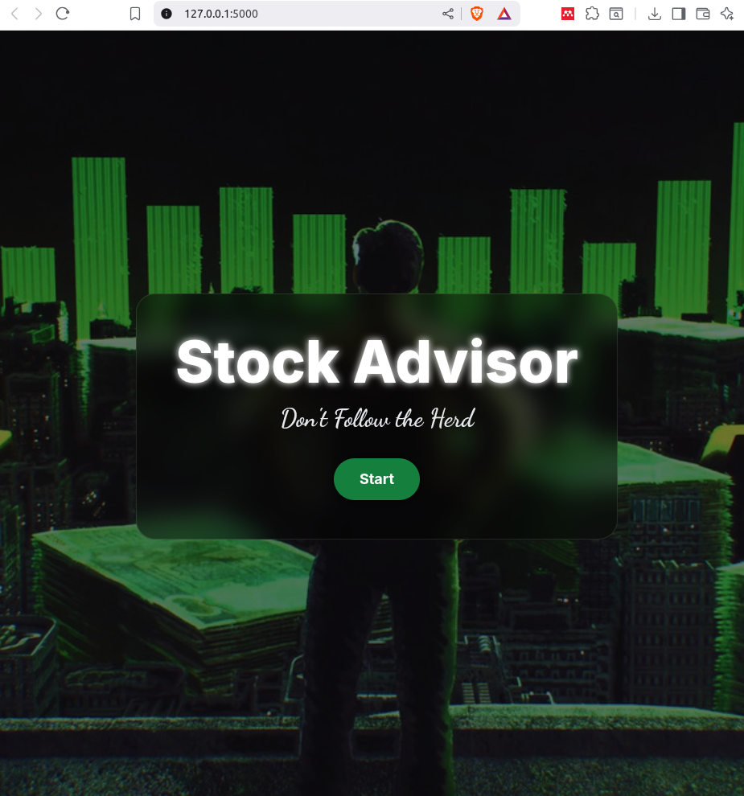
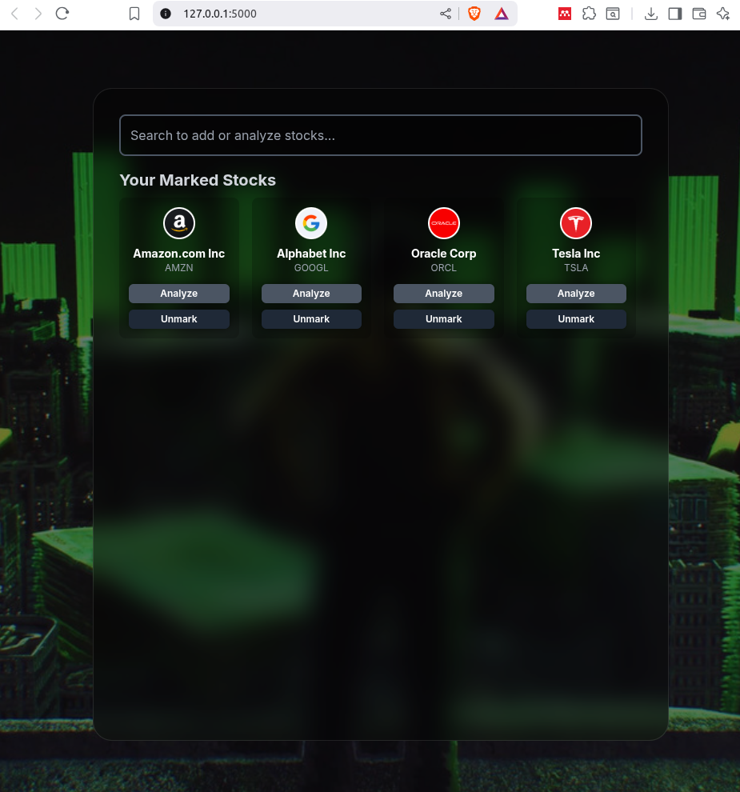
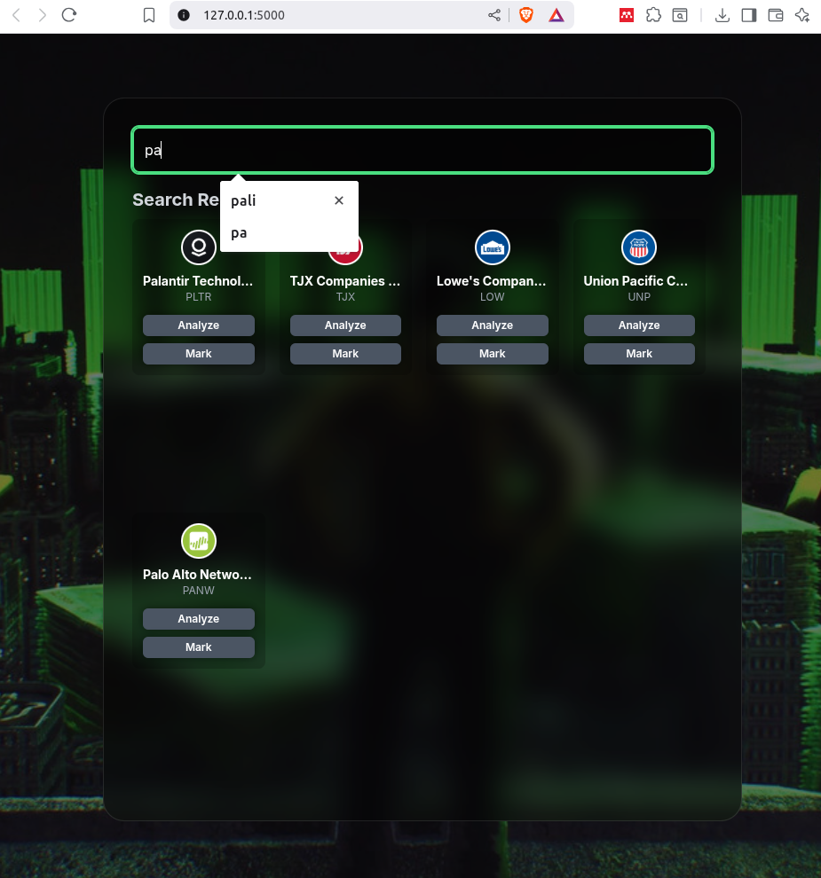
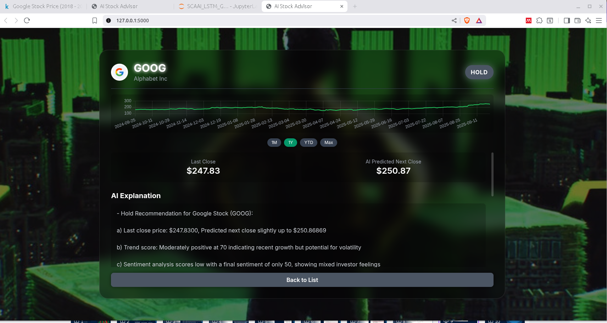

# AI Stock Advisor

A web-based application that leverages a multivariate LSTM model and a local LLM (Ollama with Phi-3) to provide stock analysis, news summaries, and buy/hold/sell recommendations. The interface is a responsive single-page application featuring a dynamic watchlist and interactive charts.

---
##  Screenshots & Demo

| Welcome Page | Main Dashboard / Watchlist | Search Bar |
|:---:|:---:|:---:|
|  |  |  |

| Detailed Analysis View |
|:---:|
|  |

##  Key Features

* **Real-time Stock Search**: Find stocks using the Finnhub API.
* **Personalized Watchlist**: Mark and unmark stocks to create a custom watchlist stored in the browser's local storage.
* **AI-Powered Analysis**: Get a detailed breakdown for any stock, including:
    * **Price Prediction**: Uses a pre-trained multivariate LSTM model to predict the next day's closing price.
    * **News Sentiment Analysis**: A local LLM (Ollama/Phi-3) scores the sentiment of recent news on a 0-100 scale.
    * **Intelligent Recommendations**: A hybrid scoring system combines price trends and news sentiment to generate a "Buy," "Hold," or "Sell" rating.
    * **LLM-Generated Explanations**: The AI provides a concise, bullet-point explanation for its recommendation.
    * **Automated News Summaries**: The LLM summarizes the latest key news articles related to the stock.
* **Interactive Historical Charts**: Visualize stock performance over different time ranges (1M, 1Y, YTD, Max) using Chart.js.
* **Modern, Responsive UI**: A sleek, glassmorphism-inspired design built with Tailwind CSS that works on all screen sizes.

---

##  How It Works

When a user requests an analysis for a stock (e.g., AAPL):

1.  **Frontend (`index.html`)**: The user clicks "Analyze", triggering a call to the `/analyze` endpoint on the Flask server.
2.  **Backend (`app.py`)**: The Flask app orchestrates the analysis pipeline.
3.  **Price Prediction (`stock_service.py`)**: Fetches the last 90 days of stock data from Yahoo Finance and uses the pre-trained Keras LSTM model to predict the next closing price.
4.  **News Aggregation (`news_service.py`)**: Fetches the latest news articles for the stock from the NewsAPI.
5.  **Sentiment Scoring (`sentiment_service.py`)**: The collected news text is passed to a local Ollama (Phi-3) instance, which returns a sentiment score from 0 (Strong Sell) to 100 (Strong Buy).
6.  **Summarization & Explanation (`app.py`)**: The backend uses Ollama again to first summarize the news articles and then to generate a natural language explanation for the final recommendation based on all available data points.
7.  **Final Scoring (`scoring.py`)**: A weighted score is calculated from the price trend and news sentiment. This final score is mapped to a "Buy," "Hold," or "Sell" recommendation using a set of hybrid rules.
8.  **Response**: The backend sends the complete analysis package (prediction, recommendation, summary, explanation, etc.) back to the frontend as a JSON object.
9.  **Rendering**: The frontend dynamically renders the detailed analysis view, including the historical data chart which is fetched from the `/history` endpoint.

---

##  Tech Stack

* **Backend**: Python, Flask
* **Frontend**: HTML, Tailwind CSS, Vanilla JavaScript
* **AI / Machine Learning**:
    * **Prediction Model**: TensorFlow / Keras (Multivariate LSTM)
    * **LLM Engine**: Ollama with the `phi3` model (for sentiment, summarization, and explanation)
* **Data Visualization**: Chart.js
* **Data Sources**:
    * Yahoo Finance (`yfinance`): Historical stock data.
    * NewsAPI: Latest company news.
    * Finnhub API: Stock search and company profile data (logos, names).

---

##  Setup and Installation

Follow these steps to get the application running on your local machine.

### 1. Prerequisites

* **Python 3.8+** and `pip`.
* **Ollama**: You must have [Ollama](https://ollama.com/) installed and running.
* **Phi-3 Model**: Pull the required LLM model by running this command in your terminal:
    ```bash
    ollama pull phi3
    ```

### 2. Clone the Repository

```bash
git clone <your-repository-url>
cd <repository-name>
```

### 3. Backend Setup
Create a virtual environment and install the required Python packages.

```bash
# Create a virtual environment
python -m venv venv

# Activate it
# On Windows:
venv\Scripts\activate
# On macOS/Linux:
source venv/bin/activate

# Install dependencies
pip install -r requirements.txt

```

### 4. API Keys Configuration
This project requires API keys from NewsAPI and Finnhub.

1. Create a file named .env in the root directory of the project.

2. Add your keys to this file like so:

```bash
# Get from [https://newsapi.org/](https://newsapi.org/)
NEWS_API_KEY='your_real_newsapi_key_here'

# Get from [https://finnhub.io/](https://finnhub.io/)
FINNHUB_API_KEY='your_real_finnhub_key_here'
```

### 5. Run the Application

With Ollama running in the background and your .env file configured, start the Flask server.

```bash
flask run
```

The application should now be accessible at http://127.0.0.1:5000
